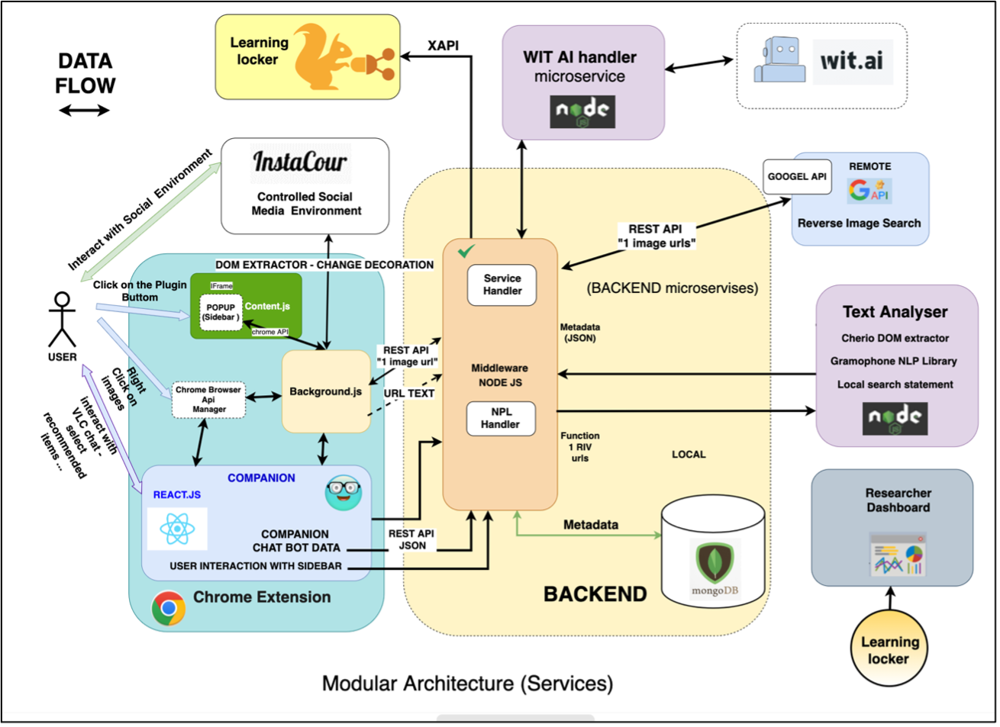

# VIRTUAL LEARNING COMPANION

https://www.youtube.com/watch?v=Q30k9OxaUkE

Durch den Virtual Learning Companion (VLC) als Ergänzung zu simulierten oder echten sozialen Medienumgebungen. Weiterhin wird der Einfluss des VLC auf die Urteilsfähigkeit, das kritische Denken, die Übereinstimmungsgrade und das Bewusstsein für sowohl nicht-toxische als auch toxische Inhalte anhand einer Kombination aus qualitativen und quantitativen statistischen Methoden untersucht. Bevor wir das VLC- System und seine potenziellen Szenarien gestaltet haben, haben wir ein Minispiel entwickelten, das es den Benutzern ermöglicht, Internetbilder anhand verschiedener Dimensionen wie Hassrede, Cyber-Mobbing, verbale Gewalt und Diskriminierung zu kategorisieren. Dieses Spiel fördert nicht nur das kritische Denken, sondern dient auch als Werkzeug für das Lernen durch Konfliktsituation. Die aus dem Spiel gesammelten Daten bieten unschätzbare Einblicke in die Wahrnehmung schädlicher Inhalte durch die Schüler und tragen dazu bei, ein verantwortungsbewusstes Online-Verhalten zu fördern. Um mögliche Kontroversen zu adressieren, haben wir verschiedene Methoden zur Bewertung von Übereinstimmungsgraden untersucht und die am besten geeignete ausgewählt, um Indizes unter den Bewertern zu berechnen. Diese ausgewählte Methode wurde ebenfalls eingesetzt, um den Grad der Übereinstimmung unter den Lernenden im Kontext der Bildmanipulation im VLC-Szenario zu messen.
Lernbegleitsysteme (LCS) verbessern traditionelle Intelligent Tutoring Systems (ITS), indem sie einen Computerbegleiter integrieren, der personalisierte Anleitung und Interaktivität bietet. Dies führt zu einer bereicherten Lernerfahrung. Als ‘Lernbegleiter’ bezeichnet, sind diese intelligenten und autonomen Roboter oder virtuellen Gesprächsagenten in der Lage, langfristige Benutzerbeziehungen aufrechtzuerhalten. Sie finden Anwendung in verschiedenen Bereichen, einschließlich Bildung und Geschäft, und konzentrieren sich auf spezielle Aufgaben wie das Lehren von Mathematik und Programmierung oder die Unterstützung der Benutzer bei Online-Transaktionen.
Unser VLC-System ist als Chrome-Plugin und als simulierte Version von Instagram mit modularen Funktionalitäten konzipiert. Dies ermöglicht eine flexible Anwendung in verschiedenen Szenarien. Wir haben auch eine Reihe von möglichen Aussagen im xAPI- Standardformat entworfen, die speziell darauf abzielen, Benutzerinteraktionen zu protokollieren.

VLC-Middleware - VLC-FrontEnd (chrome Extention)- Companion Chrome Extension - RIV-OCR service - NLP service

This project has tree main module:

Frontend ==> LC-Chrome-Extension
Middleware service ==> Middleware - core backend of companion
Natural Language Processing microservice ==> NLP-processing-Microservice

## HOW TO RUN EXTENSION

Do the following steps
1.npm install
2.npm run build
3.build folder will be created, just add this build folder as unpacked chrome extension

to install the node modules like @material-ui/core/Chip
in the LC-Chrome-Extension run "npm i"

### Test Environment:

https://pixelfed.de/

#### PixelFed:

compextentiontest@gmail.com

#### Username:

CompanionTest

#### Pass:

CompanionTest123

https://www.instagram.com/compextentiontest/

#### Instagram:

compextentiontest@gmail.com

#### username:

compextentiontest
CompanionTest

Pass:

#### CompanionTest123

InstaCour:

https://rias-insta-simulate.vercel.app/

## HOW TO RUN backend (Middleware)

create free version of mongodb atlas:
https://www.mongodb.com/cloud/atlas/register
add your key as .env file or paste the url of your key in server.js file.

to run main => npm run start:main (it will take mongo db url from .env.main)
to run dev => npm run start:developement(it will take mongo db url from .env.developement)

## HOW TO RUN backend (NLP)

npm i
node server.js on port 8080

### Errors that you might have !

to kill all the background node process:
killall node

### Curent Approch !

## To DO

chat history need refresh after right click !

## Acknowledgement 

This repository belongs to the Courage project, in which Farbod Aprin actively participated since 2020. He developed it to fulfill the objectives of his thesis and as a foundation for analysis. The "Courage" initiative involves European scholars creating an educational environment to empower adolescents with skills to effectively address discrimination and harmful social media content, encompassing fake news, conspiracy theories, hate speech, and cyber-harassment. The initiative prioritizes fostering self-protection, resilience, and critical thinking to effectively counter these challenges. As an integral part of the project, the Virtual Learning Companion (VLC), designed by Farbod Aprin under the supervision of the RIAS institute, serves as a versatile chrome plugin and adaptable chatbot aimed at mitigating harmful content. The VLC incorporates innovative scenarios, gamification strategies, and counter-narratives to amplify users' awareness and engagement. By integrating "Reverse Image Search," the VLC effectively tackles misinformation by providing diverse contextual data derived from manipulated images. Distinguished from AI techniques, this approach revolves around human-centric methodologies, highlighting the importance of recognizing fake news through educational means. The study delves into the Intelligent Tutoring System tradition, delving into experimentation with recommendations offered by the VLC to learners, based on data collected from school trials. For more information, visit couragecompanion.eu.

